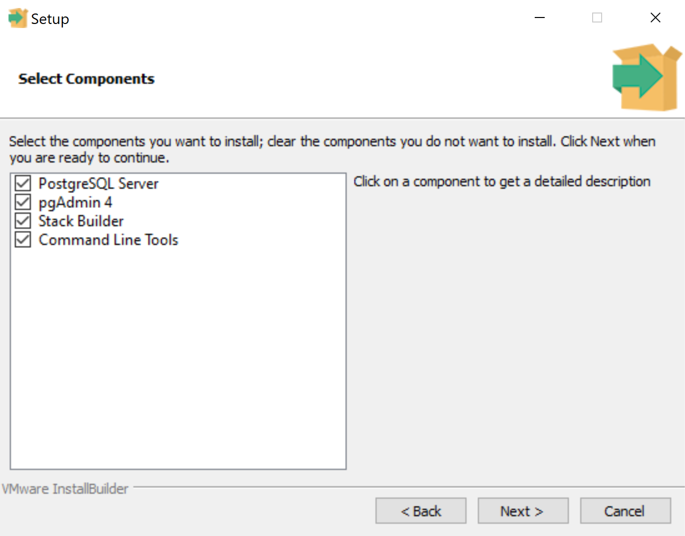
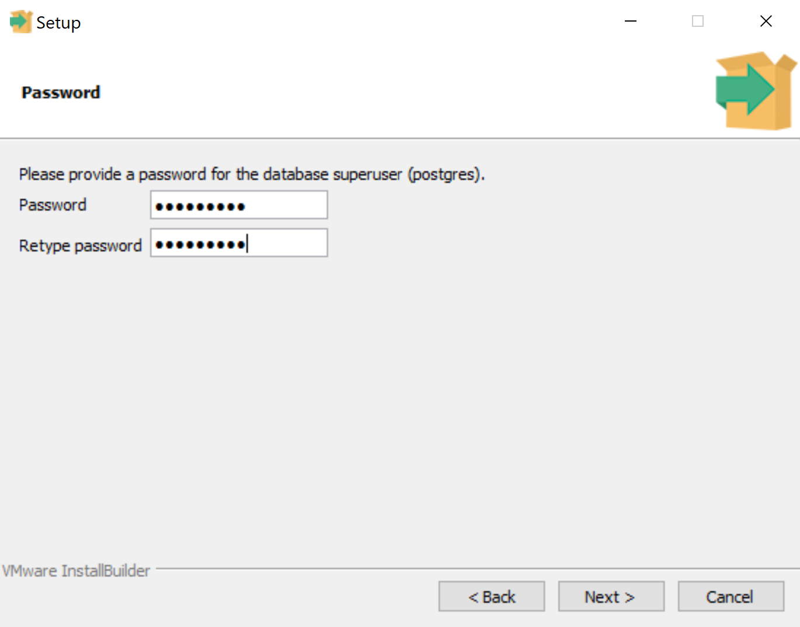
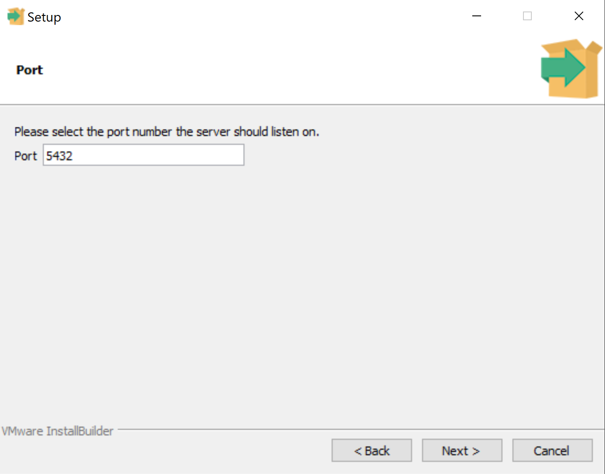

=== Setting Up a Local PostgreSQL Database
In this section, we will set up a local PostgreSQL database to store our application's data.

==== Installation
Download PostgreSQL 14.5 from https://www.enterprisedb.com/downloads/postgres-postgresql-downloads. Once the download is complete, run the installer. You can stick with the default values for most screens.

The default installation directory should be fine.

image::figs/psql-setup-installation-directory.png[PostgreSQL installation: installation directory,width=400]

Leave every component checked.



The default data directory should be fine.

image::figs/psql-setup-data-directory.png[PostgreSQL installation: data directory,width=400]

Choose a password. _IMPORTANT: do not forget this password. You will need it later._



The default port number should be fine. However, there's no problem using a different port number in case a different app is using 5432 for some reason. Just remember your choice so that you know which port your app should connect to.



The default locale should be fine.

image::figs/psql-setup-locale.png[PostgreSQL installation: locale,width=400]

The summary might look something like this:

image::figs/psql-setup-summary.png[PostgreSQL installation: summary,width=400]

There's no need for other tools, so you can skip the Stack Builder after the installation by unchecking the checkbox.

image::figs/psql-setup-skip-stack-builder.png[PostgreSQL installation: skip Stack Builder,width=400]


==== Creating a Database
Once PostgreSQL is installed, you should be able to connect to your local instance by running the command `psql -U postgres` and entering your password (I hope you haven't forgotten it already).

A server can host multiple databases. Create a new database for the event registration app using the command
```
CREATE DATABASE event_registration;
```

Check that the database exists by running the command `\l`:

image::figs/psql-create-database.png[PostgreSQL create database]
